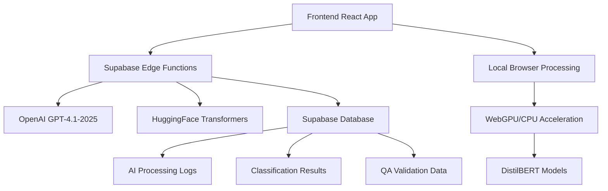

# AgriTool AI & Automation Capabilities Analysis - Phase 5 Foundation

## Executive Summary

This comprehensive analysis examines the current AI and Automation capabilities within the AgriTool farm dashboard system, providing a strategic foundation for Phase 5 development. The system demonstrates a sophisticated hybrid approach to document processing with rule-based and AI-powered extraction capabilities, though significant opportunities exist for enhancement and expansion.

---

## 1. Current AI & Automation Capabilities Inventory

### 1.1 Document Processing & Classification

**🤖 HuggingFace Transformers Integration**
- **Location**: `src/services/documentClassification.ts`
- **Technology**: HuggingFace Transformers.js with WebGPU/CPU fallback
- **Model**: DistilBERT for text classification
- **Categories**: Legal, Financial, Environmental, Technical, Certification, Other
- **Confidence Scoring**: 0.1-0.95 range with alternative suggestions
- **Current Status**: ✅ Implemented but using rule-based fallback

**🧠 Local Transformer Extraction**
- **Location**: `src/services/localTransformerExtraction.ts`
- **Technology**: Multi-pipeline approach (NER + QA)
- **Models**: BERT-large-cased (NER), DistilBERT-squad (QA)
- **Capabilities**: Named Entity Recognition, Question-Answering extraction
- **Performance**: WebGPU acceleration with CPU fallback
- **Current Status**: ✅ Implemented with confidence-based fallback recommendation

### 1.2 Hybrid Extraction Pipeline

**🔄 Multi-Stage Processing**
- **Location**: `src/hooks/useHybridExtraction.ts`
- **Approach**: Rule-based → AI-based → Merged results
- **Sources**: OpenAI GPT-4o integration via edge functions
- **Edge Functions**: `supabase/functions/hybrid-extraction/`
- **Quality Control**: Confidence thresholds and validation
- **Current Status**: ✅ Fully operational

### 1.3 AI Content Processing

**🏭 Centralized AI Pipeline**
- **Location**: `supabase/functions/ai-content-processor/`
- **Technology**: OpenAI GPT-4.1-2025 integration
- **Capabilities**: Structured data extraction from raw HTML
- **Batch Processing**: Configurable batch sizes (1-10 pages)
- **Quality Assurance**: Built-in QA validation agent
- **Current Status**: ✅ Production-ready

**🎛️ Advanced Processing Controls**
- **Location**: `src/components/admin/AIProcessingControl.tsx`
- **Features**: Model selection, temperature control, batch configuration
- **Models**: GPT-4o, GPT-4o-mini, GPT-3.5-turbo
- **Quality Controls**: Confidence thresholds, retry mechanisms
- **Processing Options**: Structure validation, quality filtering
- **Current Status**: ✅ Comprehensive admin interface

### 1.4 Document Upload & AI Prefill

**📄 Intelligent Document Processing**
- **Location**: `src/hooks/useDocumentUpload.ts`
- **AI Integration**: Automatic extraction with profile population
- **Supported Formats**: PDF, DOCX, XLSX, TXT, CSV
- **User Experience**: "Don't Ask Again" onboarding preference
- **Logging**: Complete extraction attempt tracking
- **Current Status**: ✅ Production-ready with error tracking

### 1.5 Quality Assurance & Validation

**🔍 QA Validation Agent**
- **Location**: `supabase/functions/qa-validation-agent/`
- **Technology**: OpenAI GPT-4o for precision validation
- **Capabilities**: Completeness scoring, structural integrity analysis
- **Output**: Detailed error reporting with admin escalation
- **Metrics**: Completeness score, structural integrity score
- **Current Status**: ✅ Rigorous validation pipeline

---

## 2. Technical Architecture Analysis

### 2.1 AI Infrastructure Overview



### 2.2 Data Flow Architecture

**Input Processing Pipeline:**
1. **Document Upload** → File parsing (PDF/DOCX/XLSX)
2. **Text Extraction** → Content preprocessing
3. **Classification** → Document type identification
4. **Hybrid Extraction** → Rule-based + AI processing
5. **Quality Validation** → QA agent verification
6. **Result Storage** → Structured data persistence

### 2.3 Model Integration Strategy

**Cloud-Based Processing:**
- Primary: OpenAI GPT-4.1-2025 via edge functions
- Backup: OpenAI GPT-4o, GPT-4o-mini
- Use Case: Complex document understanding, structured extraction

**Local Processing:**
- Primary: HuggingFace Transformers.js
- Models: DistilBERT, BERT-large-cased
- Use Case: Real-time classification, basic entity extraction
- Advantages: Privacy, reduced API costs, offline capability

### 2.4 Scalability & Performance

**Edge Function Architecture:**
- Serverless deployment via Supabase
- Automatic scaling based on demand
- CORS-enabled for web app integration
- Error handling with detailed logging

**Browser-Based Processing:**
- WebGPU acceleration when available
- CPU fallback for compatibility
- Browser caching for model persistence
- Progressive loading strategies

---

## 3. User Interface & Experience Assessment

### 3.1 AI Feature Visibility

**✅ Strengths:**
- Clear extraction method indicators (rule-based/AI/hybrid)
- Confidence scores prominently displayed
- Real-time processing feedback
- Comprehensive debug information for developers

**⚠️ Areas for Improvement:**
- AI suggestions could be more prominent
- Limited user education about AI capabilities
- No AI-powered insights or recommendations dashboard
- Missing predictive analytics visualization

### 3.2 User Control & Transparency

**✅ Current Implementation:**
- Manual retry with AI option
- Extraction method selection
- Confidence threshold configuration (admin)
- Complete processing transparency

**🔄 Enhancement Opportunities:**
- User-facing AI confidence explanations
- AI recommendation acceptance/rejection feedback
- Personalized AI model preferences
- Explainable AI decision paths

### 3.3 Workflow Integration

**Document Processing Workflow:**
1. Upload → 2. Auto-classify → 3. Extract data → 4. Review & edit → 5. Store
- **AI Touchpoints**: Classification (step 2), Extraction (step 3)
- **User Control**: Review and override (step 4)
- **Feedback Loop**: User corrections improve future accuracy

---

## 4. Gap Analysis & Industry Comparison

### 4.1 Missing AI Capabilities

**🚀 Predictive Analytics:**
- ❌ Crop yield prediction models
- ❌ Subsidy success probability scoring
- ❌ Market trend analysis
- ❌ Weather impact forecasting

**🤖 Intelligent Automation:**
- ❌ Automated subsidy matching recommendations
- ❌ Compliance deadline alerts with AI prioritization
- ❌ Smart document organization
- ❌ Automated report generation

**🧠 Advanced AI Features:**
- ❌ Natural language query interface
- ❌ AI-powered farm advisory system
- ❌ Automated anomaly detection
- ❌ Intelligent data validation

### 4.2 Architecture Limitations

**Scalability Concerns:**
- Local transformer models limited by browser resources
- No distributed AI processing for large farms
- Limited real-time AI capabilities
- No AI model versioning/rollback system

**Data Integration:**
- No satellite data integration for AI analysis
- Limited sensor data processing
- No external API enrichment
- Missing temporal data analysis

### 4.3 Security & Privacy Gaps

**Data Protection:**
- ✅ Edge function isolation
- ✅ Supabase RLS policies
- ⚠️ No AI data retention policies
- ⚠️ Limited audit trails for AI decisions

---

## 5. Strategic Roadmap for Phase 5

### 5.1 Immediate Priorities (Phase 5.1)

**1. Predictive Analytics Foundation**
- Implement crop yield prediction models
- Create subsidy success probability engine
- Develop market trend analysis dashboard
- Build weather impact assessment tools

**2. Enhanced AI User Experience**
- Create AI insights dashboard
- Implement natural language query interface
- Add explainable AI decision paths
- Develop personalized AI recommendations

**3. Intelligent Automation**
- Build automated subsidy matching engine
- Create smart compliance monitoring
- Implement automated report generation
- Develop intelligent document routing

### 5.2 Medium-term Goals (Phase 5.2)

**1. Advanced Data Integration**
- Satellite data integration for crop monitoring
- IoT sensor data processing pipeline
- External API enrichment (weather, market prices)
- Temporal data analysis capabilities

**2. Enterprise AI Features**
- Multi-tenant AI model customization
- Advanced analytics for large farm operations
- AI-powered risk assessment tools
- Automated compliance reporting

### 5.3 Long-term Vision (Phase 5.3)

**1. Autonomous Farm Management**
- AI-driven decision support systems
- Automated resource optimization
- Predictive maintenance scheduling
- Self-optimizing farm operations

**2. AI Ecosystem Integration**
- Third-party AI service integrations
- Custom model training pipelines
- API marketplace for AI services
- Community-driven AI improvements

---

## 6. Technical Implementation Strategy

### 6.1 AI Infrastructure Expansion

**Edge Computing Enhancement:**
```typescript
// Proposed new AI services architecture
interface AIServiceManager {
  predictiveAnalytics: PredictiveAnalyticsService;
  naturalLanguageProcessor: NLPService;
  recommendationEngine: RecommendationService;
  anomalyDetector: AnomalyDetectionService;
}
```

**Real-time AI Pipeline:**
- WebSocket-based real-time AI processing
- Stream processing for sensor data
- Event-driven AI triggers
- Caching strategies for AI responses

### 6.2 UI/UX Enhancement Plan

**AI Dashboard Components:**
1. **AI Insights Panel** - Centralized AI recommendations
2. **Predictive Analytics Charts** - Visual trend analysis
3. **Natural Language Query Bar** - ChatGPT-style interface
4. **AI Confidence Indicators** - Trust and transparency
5. **Smart Notification System** - Prioritized AI alerts

### 6.3 Data Architecture Improvements

**Enhanced Data Models:**
```sql
-- Proposed AI-enhanced schema additions
CREATE TABLE ai_predictions (
  id UUID PRIMARY KEY,
  farm_id UUID REFERENCES farms(id),
  prediction_type TEXT,
  confidence_score DECIMAL,
  prediction_data JSONB,
  actual_outcome JSONB,
  accuracy_score DECIMAL
);

CREATE TABLE ai_recommendations (
  id UUID PRIMARY KEY,
  user_id UUID,
  recommendation_type TEXT,
  ai_rationale TEXT,
  user_action TEXT,
  effectiveness_score DECIMAL
);
```

---

## 7. Security & Compliance Framework

### 7.1 AI Data Governance

**Data Protection Measures:**
- AI processing audit trails
- Model decision explainability
- User consent management for AI features
- Data retention policies for AI training

**Privacy by Design:**
- Local processing preference options
- Anonymization for AI training data
- User control over AI data usage
- Transparent AI decision making

### 7.2 Model Governance

**Quality Assurance:**
- A/B testing framework for AI models
- Performance monitoring dashboards
- Model drift detection
- Automated model validation

---

## 8. Success Metrics & KPIs

### 8.1 AI Performance Metrics

**Accuracy Metrics:**
- Document classification accuracy: Target 95%+
- Extraction confidence scores: Average 85%+
- User correction rates: <10%
- False positive rates: <5%

**User Experience Metrics:**
- AI feature adoption rates
- User satisfaction scores for AI features
- Time saved through AI automation
- AI recommendation acceptance rates

### 8.2 Business Impact Metrics

**Operational Efficiency:**
- Document processing time reduction: Target 70%
- Subsidy application success rates
- Compliance deadline adherence
- Administrative workload reduction

**User Engagement:**
- AI feature usage frequency
- Advanced feature adoption
- User retention with AI features
- Premium feature conversion rates

---

## 9. Recommendations for Phase 5 Implementation

### 9.1 Immediate Actions

1. **Enhance Current AI Features**
   - Improve classification model accuracy
   - Add user feedback loops for continuous learning
   - Implement A/B testing for AI algorithms

2. **Develop AI Dashboard**
   - Create centralized AI insights interface
   - Add predictive analytics visualizations
   - Implement natural language query capability

3. **Expand Automation**
   - Build automated subsidy matching
   - Create intelligent document routing
   - Develop smart notification system

### 9.2 Strategic Initiatives

1. **Data Integration Platform**
   - Satellite data integration
   - IoT sensor processing
   - External API enrichment

2. **Advanced AI Services**
   - Predictive modeling capabilities
   - Recommendation engines
   - Anomaly detection systems

3. **Enterprise Features**
   - Multi-tenant AI customization
   - Advanced analytics suites
   - AI-powered compliance tools

---

## Conclusion

The AgriTool system demonstrates a solid foundation in AI and automation with sophisticated document processing, classification, and extraction capabilities. The hybrid approach combining local and cloud-based AI processing provides an excellent balance of performance, privacy, and capability.

**Key Strengths:**
- Robust hybrid extraction pipeline
- Comprehensive quality assurance
- Scalable edge function architecture
- User-centric design with transparency

**Primary Opportunities:**
- Predictive analytics implementation
- Enhanced user experience with AI insights
- Intelligent automation expansion
- Advanced data integration capabilities

**Strategic Direction for Phase 5:**
Focus on transforming from reactive document processing to proactive farm management through predictive analytics, intelligent automation, and enhanced user experience. The existing technical foundation provides an excellent platform for these advanced capabilities.

**Estimated Development Timeline:**
- Phase 5.1 (Immediate): 2-3 months
- Phase 5.2 (Medium-term): 4-6 months  
- Phase 5.3 (Long-term): 8-12 months

The system is well-positioned to become a leading AI-powered agricultural management platform with the proposed enhancements.