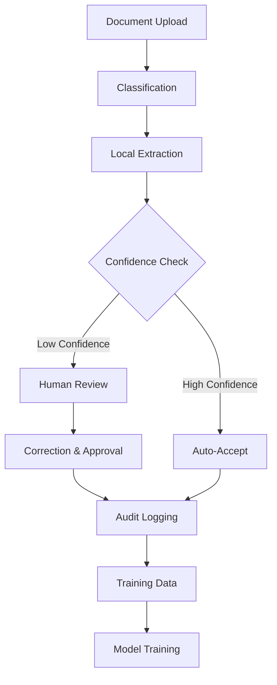

# AgriTool Documentation

Welcome to the AgriTool comprehensive documentation. This documentation covers the multi-phase document processing workflow, including classification, extraction, human review, and training pipeline systems.

## Quick Navigation

- [Architecture Overview](./architecture/README.md) - High-level system design and workflow
- [Feature Guides](./features/README.md) - Detailed feature documentation
- [Configuration Guide](./configuration/README.md) - Environment setup and configuration
- [Developer Guide](./development/README.md) - Development setup and contribution guidelines
- [Troubleshooting](./troubleshooting/README.md) - Common issues and solutions

## System Overview

AgriTool is a comprehensive document processing platform designed for agricultural document management with AI-powered classification, extraction, and review capabilities.

### Core Features

1. **Document Classification** - Automated categorization using HuggingFace transformers
2. **Local Extraction** - Browser-based entity extraction with fallback mechanisms
3. **Human Review Interface** - Comprehensive review and correction workflow
4. **Training Pipeline** - ML model training and deployment (simulation mode available)
5. **Audit Trail** - Complete tracking of all document processing activities

### Workflow Stages



## Getting Started

1. **Setup**: Follow the [Development Guide](./development/setup.md) for local setup
2. **Configuration**: See [Configuration Guide](./configuration/environment.md) for environment variables
3. **Testing**: Run the test suite as described in [Testing Guide](./development/testing.md)
4. **Deployment**: Check [Deployment Guide](./configuration/deployment.md) for production setup

## Documentation Structure

```
docs/
├── architecture/          # System architecture and design
├── features/              # Feature-specific documentation
├── configuration/         # Setup and configuration guides
├── development/           # Developer guides and API docs
├── troubleshooting/       # Common issues and solutions
└── assets/               # Images, diagrams, and other assets
```

## Support and Contributing

- **Issues**: Report issues in the project repository
- **Contributing**: See [Contributing Guide](./development/contributing.md)
- **Community**: Join our community discussions

---

*This documentation is maintained alongside the codebase and updated with each release.*