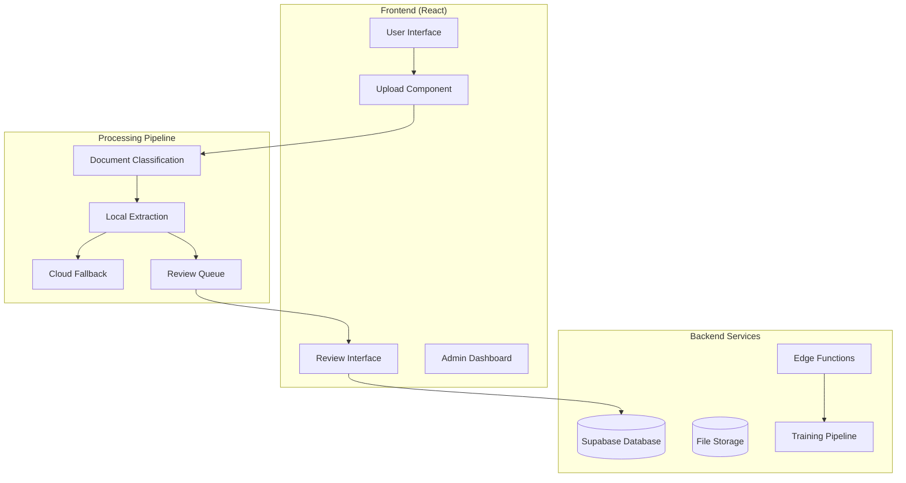
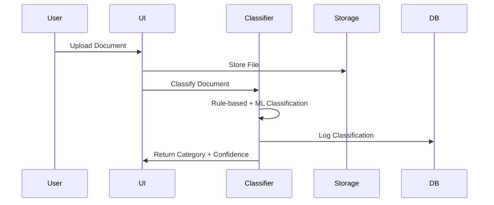
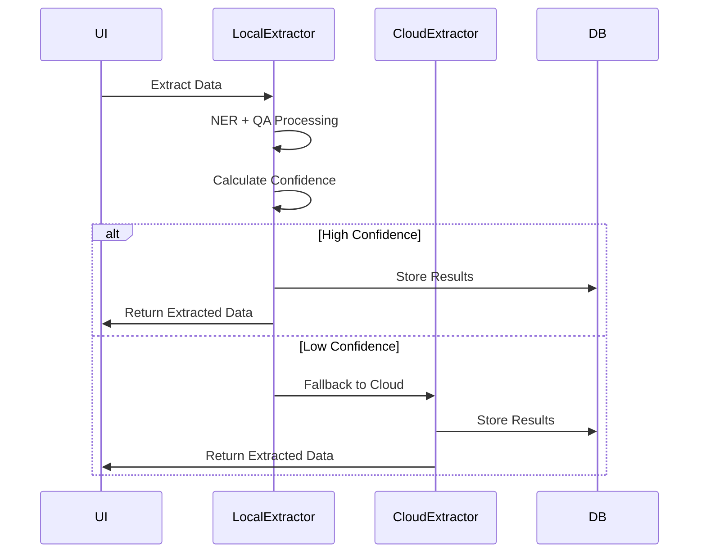
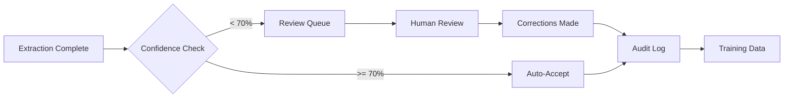
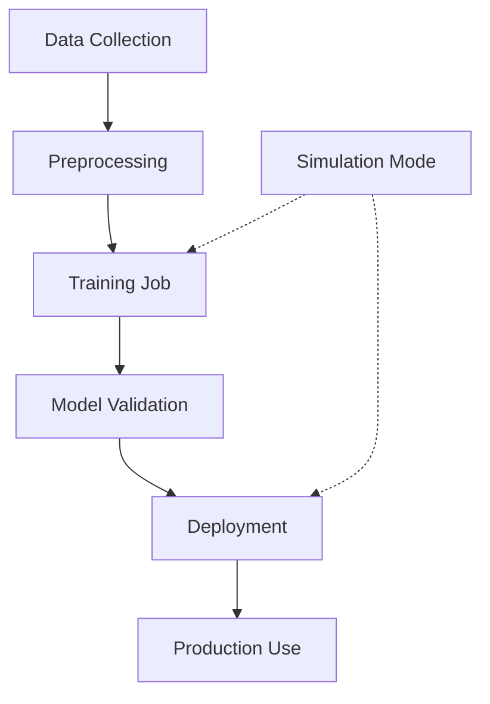
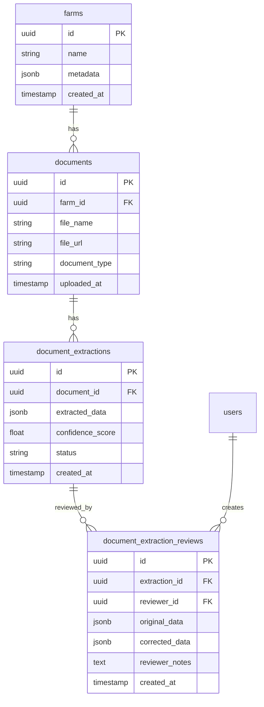

# Architecture Overview

AgriTool implements a multi-stage document processing pipeline designed for scalability, reliability, and maintainability.

## System Architecture

### High-Level Components

### Technology Stack

- **Frontend**: React 18, TypeScript, Tailwind CSS
- **Backend**: Supabase (PostgreSQL, Auth, Storage, Edge Functions)
- **ML/AI**: HuggingFace Transformers.js, OpenAI API
- **Testing**: Vitest, React Testing Library
- **Build**: Vite, ESBuild

## Processing Workflow

### 1. Document Upload and Classification

**Key Features:**
- Hybrid classification (rule-based + ML)
- Multiple model support with fallback
- Confidence scoring and logging

### 2. Data Extraction Pipeline

**Key Features:**
- Browser-based local processing
- Intelligent fallback mechanisms
- Configurable confidence thresholds
- Multi-model entity extraction

### 3. Human Review System

**Key Features:**
- Confidence-based routing
- Comprehensive review interface
- Audit trail for all corrections
- Integration with training pipeline

### 4. Training Pipeline

**Key Features:**
- Simulation mode for safe testing
- Automated data preprocessing
- Model validation and metrics
- Staged deployment process

## Data Architecture

### Database Schema

### Security Model

- **Row Level Security (RLS)** on all tables
- **User-based access control** for farm data
- **Audit logging** for all data modifications
- **Encrypted storage** for sensitive documents

## Performance Considerations

### Frontend Optimization
- **Code splitting** for large components
- **Lazy loading** for heavy ML models
- **Browser caching** for model artifacts
- **Optimistic updates** for better UX

### Backend Optimization
- **Database indexing** on frequently queried fields
- **Connection pooling** for database access
- **Edge function caching** for static responses
- **Batch processing** for training operations

### Scaling Strategy
- **Horizontal scaling** via Supabase infrastructure
- **CDN distribution** for static assets
- **Regional deployment** for reduced latency
- **Queue-based processing** for heavy workloads

## Monitoring and Observability

### Logging Strategy
- **Structured logging** with consistent formats
- **Error tracking** with context preservation
- **Performance metrics** for critical paths
- **Security event logging** for audit compliance

### Health Checks
- **Service availability** monitoring
- **Database connectivity** checks
- **ML model availability** validation
- **Storage accessibility** verification

---

*For more detailed information, see the specific architecture documents in this directory.*